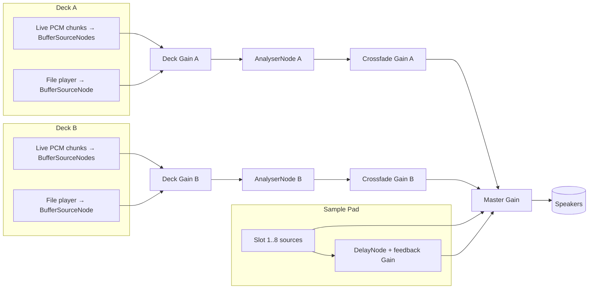

# CARELESS-LIVEDJ — Stage 0 (TINS Specification)

> Dual-stream Gemini Lyria Live DJ desktop application
> Tauri 2 + Vite + React 18 + TypeScript, Windows single-user, BYOK
> TINS-compliant unification of: Lyria-intergration-TINS.md, Lyria-stage2-LivePipeline-TINS.md, stage21-LIVE-music-session-save-plan.md, stage37-MUSIC-gallery-retry-plan.md, ascii-spectrograph/*, realtime-audio/*

---

## 1. Description

**CARELESS-LIVEDJ** is a desktop DJ application that runs **two simultaneous Gemini Lyria Live music-generation websocket sessions** (Plate A and Plate B) and lets a single local user mix them in real time with a crossfader, a per-side sample pad, prompt caches, and a local music library. The app is a Tauri 2 binary built around a Vite/React/TypeScript renderer with a Rust backend that owns the API key(s), the filesystem, and the background task queue.

The core proposition is that two live Lyria streams can be played, recorded, and crossfaded as if they were two physical decks on a DJ console. The user supplies their own Gemini API key(s) (BYOK); the application stores them in the OS keyring (Windows Credential Manager) via the `keyring` Rust crate and never exposes them to the renderer process — only the constructed session URL is returned. Every live session is continuously archived to disk in rotating PCM segments so a crash never costs more than one segment of audio.

The interface is dark-first, styled after the approved `ascii-spectrograph/demo.html` reference (warm bone surfaces, near-black ink, single vermilion accent, three-typeface system, squared corners, fractal-noise grain overlay), implemented with Basel design tokens unified under a single `--dj-*` namespace. A full-width ASCII spectrograph at the top of the window visualises both decks side by side, separated by a single character divider.

---

## 2. Functionality

### 2.1 Top-level layout (mirrors `cross-the-streams.png`)

```
┌──────────────────────────────────────────────────────────────────────────┐
│  ASCII SPECTROGRAPH STRIP  (full width, 110 cols × 10 rows)              │
│  PLATE·A  ┊  ··░░▒▒▓▓██▓▓▒▒░░··  │  ··░░▒▒▓▓██▓▓▒▒░░··  ┊  PLATE·B       │
├──────────────────────────────────────────────────────────────────────────┤
│  GEMINI LIVE DJ / CROSS THE STREAMS                                      │
├──────┬──────────────────┬────────────────┬──────────────────┬────────────┤
│CACHE │                  │  CROSSFADER    │                  │   CACHE    │
│-A-   │   ┌──────────┐   │  ┌──────────┐  │   ┌──────────┐   │   -B-      │
│      │   │ PLATE A  │   │  │  ┃    ┃  │  │   │ PLATE B  │   │            │
├──────┤   │  (deck)  │   │  │  ┃    ┃  │  │   │  (deck)  │   ├────────────┤
│SEARCH│   │          │   │  │  ┃    ┃  │  │   │          │   │  SEARCH    │
│-A-   │   │          │   │  │  ┃    ┃  │  │   │          │   │  -B-       │
│      │   └──────────┘   │  └──────────┘  │   └──────────┘   │            │
├──────┴──────────────────┴────────────────┴──────────────────┴────────────┤
│  SAMPLEPAD  [1] [2] [3] [4] [5] [6] [7] [8]                              │
└──────────────────────────────────────────────────────────────────────────┘
```

| Region | Component | Owns |
|---|---|---|
| **Header strip** | `<DualSpectroStrip>` | dual-deck audio visualisation |
| **Title bar** | `<AppTitleBar>` | brand mark, Settings button, theme toggle |
| **Sidebar L cache** | `<PromptCache deck="A">` | recent prompt sets for Plate A |
| **Sidebar L search** | `<TrackLibrarySearch deck="A">` | search & queue local tracks for Plate A |
| **Center-left** | `<DeckPanel deck="A">` | Plate A play/pause/reset, prompt list, parameter panel, REC, deck volume readout |
| **Center** | `<CrossfaderPanel>` | crossfader slider, Link toggle, two side-volume sliders, BPM/A·B time read-out |
| **Center-right** | `<DeckPanel deck="B">` | Plate B (mirror of A) |
| **Sidebar R cache** | `<PromptCache deck="B">` | recent prompt sets for Plate B |
| **Sidebar R search** | `<TrackLibrarySearch deck="B">` | search & queue local tracks for Plate B |
| **Footer strip** | `<SamplePad>` | 8 sample slots, upload, mic, loop, echo |
| **(modal)** | `<MusicGallery>` | albums, multi-select, ZIP, retry |
| **(modal)** | `<SettingsModal>` | API keys, theme, library root, recording dir, recovery banner |

### 2.2 Two decks (Plate A & Plate B) — per-deck features

For each deck independently:

1. **Play / Pause / Stop / Reset Context** transport controls.
2. **Prompt list** (up to 5 weighted prompts; rules: text non-empty AND weight ≠ 0 to be considered "valid"; at least one valid prompt to enable Play). Live prompt edits apply via `setWeightedPrompts` without session reset.
3. **Parameter panel** (BPM 60–200, density 0–1, brightness 0–1, guidance 0–6, temperature 0–3, scale enum, mute_bass / mute_drums / only_bass_and_drums with mutual exclusion enforced in UI, music_generation_mode enum). BPM and Scale changes call `resetContext` (hard transition); all other parameters apply smoothly.
4. **Library track playback** (when the deck plays a pre-recorded track instead of a Lyria stream — mutually exclusive: live mode XOR file mode per deck).
5. **REC button** for explicit recording; auto-record-on-connect setting (default ON).
6. **Deck volume slider** (independent of crossfader when **Link** is OFF).
7. **Reconnect button** appears if the deck WebSocket closed unexpectedly.
8. **Filtered-prompt warning banner** when the safety filter trips.
9. **Status pill**: `disconnected` / `connecting` / `connected` / `playing` / `paused` / `error`.

### 2.3 Crossfader (center)

- **Crossfader** horizontal slider, range −1…+1, initial 0.
- **Equal-power curve**: `gainA = cos((value+1)/2 · π/2)`, `gainB = sin((value+1)/2 · π/2)`. Result: at value 0 each deck reads ≈ 0.707 (−3 dB) — no audible dip when sweeping.
- **Two vertical sliders** for per-deck volume (independent attenuation pre-crossfader).
- **Link toggle**: when ON, the two vertical sliders move together inversely (dragging A up drags B down by the same amount). When OFF they are independent.
- **Keyboard nudge**: `←` / `→` move the crossfader by 0.05 per keystroke; `Shift+←` / `Shift+→` snap to the nearest 0.25.
- **Centre snap**: holding `Alt` and double-clicking the crossfader resets to 0.

### 2.4 Sidebars (per side)

Each sidebar contains two stacked panels:

1. **Prompt cache** — chronological list of the **last 30** distinct prompt-sets ever sent on that deck. Click to load into the deck (replaces current prompts). Persisted in SQLite (`prompt_cache_a`, `prompt_cache_b`).
2. **Library search** — text search over the local SQLite `tracks` table; filter by album. Click a result to enqueue it on this deck (live mode auto-pauses; file mode begins playback when the user hits Play). Drag-and-drop a row onto the deck has identical effect.

### 2.5 Sample pad (footer, 8 slots)

| Feature | Behaviour |
|---|---|
| **8 slots** | Numbered 1–8, mapped to keyboard keys `1`–`8` (no modifiers). |
| **Dynamic responsive columns** | 8 columns ≥ 1280 px wide; 4 cols 768–1279 px; 2 cols < 768 px. |
| **Audio file upload** | Drag-and-drop OR click-to-browse; accepts `.wav`/`.mp3`/`.ogg`/`.flac`. File is decoded into an `AudioBuffer` and the source PCM bytes are saved to `{appDataDir}/careless-livedj/samples/<slot>.bin` plus a SQLite row. |
| **Microphone recording** | Hold `Shift+<n>` (n = slot number) to record from the default input device for as long as the keys are held. Release to stop, encode as WAV, save to slot. |
| **Real-time playback** | Tap key `<n>` → fire `AudioBufferSourceNode` connected through the slot's gain (and optional echo) into the **master gain** (post-crossfade) so samples are always heard regardless of crossfader position. |
| **Loop mode toggle** | Per-slot toggle button. When ON, `source.loop = true`; tap key `<n>` again to stop the looping source. |
| **Echo effect toggle** | Per-slot toggle. When ON, slot output additionally feeds a `DelayNode` (default 0.25 s) with a feedback `GainNode` (default 0.45) into the master gain. **Wet/dry knobs are not in stage 0** — fixed wet=0.35 in stage 0, exposed in stage 1+. |
| **Clear individual slot** | Right-click a slot → "Clear". Removes file from disk, deletes DB row, resets toggles. |
| **Purge all data** | Footer button; confirmation modal "Delete all 8 samples and reset toggles?" → wipes `samples/` directory and clears the table. |

### 2.6 Music Gallery (modal)

Opened via title-bar button. Operates on the SQLite `tracks` and `albums` tables. All long-running operations (ZIP build, regeneration retries) are pushed to the **background task queue** so closing the modal does **not** cancel the work.

| Feature | Behaviour |
|---|---|
| **Album cards** | Visual cards listing albums; create / rename / delete. Default album: "Sessions". |
| **Track grid** | All tracks under the selected album. Each card shows title, duration, format (`wav`), prompts summary, status (`ready` / `submitted` / `in_progress` / `failed`). |
| **Multi-select** | Toggle "Select" mode → checkboxes on every card. Selected tracks → "Download as ZIP" → native save dialog → Rust `zip` builder writes file. |
| **Album → ZIP** | Per-album action "Download album as ZIP" (entire album contents). |
| **Retry** | Failed tracks (`status = 'failed'`) show a `↻ Retry` button. Retry resets `created_at = unixepoch()` (sweep bypass), clears `error_message`, sets `status = 'submitted'`, and re-enqueues. **A `retry_count` column is added from the start** with `max_retries = 3` (gotcha H7). |
| **Recover unfinished session** | If on app launch the recovery scan finds `manifest.json` files with no assembled WAV, a yellow banner in the gallery offers `Assemble` / `Recover individually` / `Discard`. |
| **Delete** | Single-track delete (with confirmation) and album delete (cascades). Backed by Tauri `fs` commands. |

### 2.7 Settings modal

| Field | Stored at | Notes |
|---|---|---|
| **Gemini API key A** | OS keyring (`keyring` crate) | required; never crosses the Tauri IPC boundary as plaintext — only the **session URL** does, vended by a Rust command |
| **Gemini API key B** | OS keyring (`keyring` crate) | optional; if blank, the renderer copies key A into deck-B requests. **Default UI shows two fields** because Gemini's documented limit is one live session per key — running both decks from one key may fail. (Stage 1+ replaces these two fixed slots with a multi-key vault, see `stage1plus-implementation-plan.md` §5.) |
| **Music library root** | `app_config.json` in `appDataDir` | folder scanned for the Library Search panel |
| **Recordings directory** | `app_config.json` | where assembled WAV tracks land (default `{appDataDir}/careless-livedj/recordings`) |
| **Theme** | `localStorage` (Tauri webview) | `dark` (default) / `light` |
| **Auto-record on connect** | `app_config.json` | default `true`; per-deck identical |
| **Segment rotation interval** | `app_config.json` | default 60 s (smaller than the cloud plan's 120 s for tighter recovery) |
| **Recovery banner** | derived from disk scan | shows count of pending sessions and links to the gallery banner |

### 2.8 Reconnect & error UX

- Unexpected WebSocket close (event code ≠ 1000) → status `error`, banner "Lost Lyria connection on Plate X. [Reconnect]". One-click reconnect creates a new session and re-sends current prompts and config.
- Filtered-prompt warning shows inline on the deck panel, does not stop playback.
- Connection failure on initial Play → automatic single retry after 2 s; if that also fails, status `error` with manual reconnect.

---

## 3. Technical Implementation

### 3.1 Stack

| Layer | Choice | Notes |
|---|---|---|
| Runtime shell | **Tauri 2** | Windows single-binary; webview is WebView2 (Chromium-derived) |
| Build | **Vite 5** + **TypeScript 5** | strict mode; single SPA |
| UI | **React 18** | function components + hooks; no class components |
| State | **Zustand** | one store per concern (decks, gallery, samplepad, settings); avoids prop drilling and is trivial to access from inside non-React refs (audio nodes, recorders) |
| Styling | **CSS Modules** + a single global `tokens.css` | no Tailwind, no styled-components — keeps the demo.html aesthetic literal |
| Routing | **none** | single-window app, modals over the main view |
| Local DB | **`@tauri-apps/plugin-sql`** (SQLite) | for albums, tracks, sample slots, prompt caches, gallery task queue |
| Filesystem | **`@tauri-apps/plugin-fs`** | renderer-side reads/writes for app config and asset URLs |
| Native dialogs | **`@tauri-apps/plugin-dialog`** | save-as for ZIPs, folder picker for library root |
| Secret store | **`keyring` crate** (Windows Credential Manager) | API key storage; per-OS-user account scoped. Right ceiling for a single-user local desktop app — Stronghold-class encryption was considered and rejected as not justified by the threat model (see `stage1plus-implementation-plan.md` §5). |
| Rust crates | `tokio`, `serde`, `zip = "2"`, `hound = "3"` (or manual WAV header), `keyring = "3"`, `base64`, `walkdir`, `id3`, `sha2` | last four added in stage 1+ |

### 3.2 Repository / file layout

```
careless-livedj/
├── package.json
├── vite.config.ts
├── tsconfig.json
├── index.html
├── src-tauri/
│   ├── Cargo.toml
│   ├── tauri.conf.json
│   ├── build.rs
│   └── src/
│       ├── main.rs                       # Tauri builder, plugin registration
│       ├── state.rs                      # AppState, DbPool, TaskQueueHandle
│       ├── commands/
│       │   ├── mod.rs
│       │   ├── secrets.rs                # store_api_key, load_api_key, get_live_session_url
│       │   ├── library.rs                # scan_music_library, list_albums, list_tracks
│       │   ├── recording.rs              # write_segment, list_pending_sessions,
│       │   │                              # assemble_session, recover_session
│       │   ├── samples.rs                # save_sample, load_sample, delete_sample, purge_samples
│       │   ├── zip.rs                    # build_zip_from_track_ids, build_zip_from_album
│       │   └── tasks.rs                  # enqueue, list_pending, retry_task, cancel_task
│       ├── db/
│       │   ├── mod.rs
│       │   └── migrations/
│       │       ├── 001_init.sql
│       │       └── 002_retry_count.sql
│       └── tasks/
│           ├── mod.rs                    # TaskQueue (tokio mpsc + worker pool)
│           └── workers.rs                # music_regen_worker, zip_worker
├── src/
│   ├── main.tsx                          # React root, Tauri init
│   ├── App.tsx                           # AppLayout
│   ├── styles/
│   │   ├── tokens.css                    # --dj-* CSS variables (light + dark)
│   │   ├── global.css                    # body, font face declarations, grain overlay
│   │   └── reset.css
│   ├── audio/
│   │   ├── audioGraph.ts                 # AudioGraphSingleton: ctx, master gain, analyser
│   │   ├── crossfade.ts                  # equal-power curve helpers
│   │   ├── pcm.ts                        # decode chunk, schedule chunk, gapless clock
│   │   ├── wavEncoder.ts                 # Float32 → WAV Blob/Uint8Array
│   │   └── pcmRecorder.ts                # rotating segment recorder
│   ├── lyria/
│   │   ├── liveAudioClient.ts            # createLiveSession (Tauri command wrapper)
│   │   ├── messageHandler.ts             # parse server messages, dual-field guard
│   │   ├── wireFormat.ts                 # send helpers (prompts, config, playback)
│   │   └── useLiveMusicSession.ts        # the per-deck React hook
│   ├── decks/
│   │   ├── useDeck.ts                    # combines live session + file source + deck gain
│   │   └── useTrackPlayback.ts           # for pre-recorded track playback
│   ├── samplepad/
│   │   ├── useSamplePad.ts
│   │   ├── recordMic.ts
│   │   └── echoChain.ts
│   ├── gallery/
│   │   ├── useGallery.ts
│   │   ├── usePendingTasksPoller.ts
│   │   └── retry.ts
│   ├── settings/
│   │   ├── useSettings.ts
│   │   └── secrets.ts                    # invoke wrappers for keyring commands
│   ├── store/
│   │   ├── decksStore.ts                 # Zustand: per-deck state (status, prompts, config)
│   │   ├── crossfadeStore.ts
│   │   ├── samplepadStore.ts
│   │   ├── galleryStore.ts
│   │   └── settingsStore.ts
│   ├── components/
│   │   ├── AppLayout.tsx
│   │   ├── DualSpectroStrip.tsx          # adapted from djz-ascii-spectro.jsx
│   │   ├── AppTitleBar.tsx
│   │   ├── DeckPanel.tsx                 # owns: PromptDeck, ParameterPanel, TransportBar
│   │   ├── PromptDeck.tsx
│   │   ├── ParameterPanel.tsx
│   │   ├── TransportBar.tsx
│   │   ├── CrossfaderPanel.tsx
│   │   ├── PromptCache.tsx
│   │   ├── TrackLibrarySearch.tsx
│   │   ├── SamplePad.tsx
│   │   ├── SamplePadSlot.tsx
│   │   ├── MusicGallery.tsx
│   │   ├── AlbumCard.tsx
│   │   ├── TrackCard.tsx
│   │   ├── SettingsModal.tsx
│   │   ├── ThemeToggle.tsx
│   │   ├── Toast.tsx
│   │   └── RecoveryBanner.tsx
│   ├── types/
│   │   ├── lyria.ts
│   │   ├── library.ts
│   │   ├── samplepad.ts
│   │   ├── recording.ts
│   │   └── tasks.ts
│   └── utils/
│       ├── ids.ts                        # generateId() = crypto.randomUUID
│       ├── time.ts                       # mm:ss formatter
│       └── throttle.ts
└── README.md
```

### 3.3 Audio graph (single shared `AudioContext`)



**Why one AudioContext, not two:** browsers cap concurrent AudioContexts (typically 6) and creating two would force resampling logic and complicate analyser sharing. A single `AudioContext({ sampleRate: 48000 })` matches the Lyria PCM stream natively (no resampling) and lets every node be addressed from one timeline.

**`audioGraph.ts` (the singleton):**

```typescript
// src/audio/audioGraph.ts
type Deck = 'A' | 'B';

class AudioGraph {
  ctx!: AudioContext;
  deckGain: Record<Deck, GainNode> = { A: null!, B: null! };
  deckAnalyser: Record<Deck, AnalyserNode> = { A: null!, B: null! };
  crossfadeGain: Record<Deck, GainNode> = { A: null!, B: null! };
  master!: GainNode;

  init(): void {
    if (this.ctx) return;
    this.ctx = new AudioContext({ sampleRate: 48000 });
    this.master = this.ctx.createGain();
    this.master.gain.value = 1;
    this.master.connect(this.ctx.destination);

    (['A', 'B'] as Deck[]).forEach((d) => {
      const dg = this.ctx.createGain();
      const an = this.ctx.createAnalyser();
      const xf = this.ctx.createGain();
      an.fftSize = 2048;
      an.smoothingTimeConstant = 0;
      dg.connect(an);
      an.connect(xf);
      xf.connect(this.master);
      this.deckGain[d] = dg;
      this.deckAnalyser[d] = an;
      this.crossfadeGain[d] = xf;
    });
  }

  async resume(): Promise<void> {
    if (this.ctx.state === 'suspended') await this.ctx.resume();
  }

  setCrossfade(value: number, link: boolean): void {
    // value range: -1 (full A) .. +1 (full B). Equal-power curve.
    const v = Math.max(-1, Math.min(1, value));
    const x = (v + 1) / 2;
    this.crossfadeGain.A.gain.value = Math.cos(x * Math.PI / 2);
    this.crossfadeGain.B.gain.value = Math.sin(x * Math.PI / 2);
    void link;
  }

  setDeckVolume(deck: Deck, value: number): void {
    this.deckGain[deck].gain.value = Math.max(0, Math.min(1.5, value));
  }
}

export const audioGraph = new AudioGraph();
```

**Wet=0.35 echo chain helper:**

```typescript
// src/samplepad/echoChain.ts
export function buildEchoChain(
  ctx: AudioContext,
  delayMs = 250,
  feedback = 0.45,
  wet = 0.35,
): { input: GainNode; output: GainNode } {
  const input = ctx.createGain();
  const dry = ctx.createGain();
  const wetGain = ctx.createGain();
  const delay = ctx.createDelay(2.0);
  const fb = ctx.createGain();
  const output = ctx.createGain();

  delay.delayTime.value = delayMs / 1000;
  fb.gain.value = feedback;
  dry.gain.value = 1 - wet;
  wetGain.gain.value = wet;

  input.connect(dry).connect(output);
  input.connect(delay);
  delay.connect(fb).connect(delay);  // feedback loop
  delay.connect(wetGain).connect(output);

  return { input, output };
}
```

### 3.4 Lyria session — adapted for Tauri

#### 3.4.1 Tauri command: vending the session URL

```rust
// src-tauri/src/commands/secrets.rs
use tauri::State;

#[tauri::command]
pub async fn store_api_key(
    deck: String,                // "A" | "B"
    key: String,
    state: State<'_, crate::state::AppState>,
) -> Result<(), String> {
    state.secrets.store(&format!("gemini_key_{}", deck.to_lowercase()), &key)
        .map_err(|e| e.to_string())
}

#[tauri::command]
pub async fn get_live_session_url(
    deck: String,
    state: State<'_, crate::state::AppState>,
) -> Result<String, String> {
    let key_id = format!("gemini_key_{}", deck.to_lowercase());
    let key = state.secrets.load(&key_id)
        .map_err(|e| e.to_string())?
        .ok_or_else(|| format!("No API key stored for deck {}", deck))?;
    let url = format!(
        "wss://generativelanguage.googleapis.com/ws/google.ai.generativelanguage.v1alpha.GenerativeService.BidiGenerateContent?key={}",
        urlencoding::encode(&key)
    );
    Ok(url)
}
```

The renderer never sees the raw key — only the URL with the key encoded into it. The URL is held in a JS variable for the lifetime of the WebSocket and never logged or persisted.

#### 3.4.2 The per-deck hook

```typescript
// src/lyria/useLiveMusicSession.ts
import { useEffect, useRef, useState, useCallback } from 'react';
import { invoke } from '@tauri-apps/api/core';
import { audioGraph } from '../audio/audioGraph';
import { PcmRecorder } from '../audio/pcmRecorder';
import { handleServerMessage } from './messageHandler';
import {
  sendSetWeightedPrompts,
  sendSetMusicGenerationConfig,
  sendPlaybackControl,
  sendSetup,
} from './wireFormat';
import type { Deck, WeightedPrompt, MusicConfig, SessionStatus } from '../types/lyria';

export interface LiveSessionApi {
  status: SessionStatus;
  error: string | null;
  filteredPromptWarning: string | null;
  isRecording: boolean;
  recordingElapsedSeconds: number;
  playElapsedSeconds: number;
  play: () => Promise<void>;
  pause: () => void;
  stop: () => Promise<void>;
  resetContext: () => void;
  applyPrompts: (prompts: WeightedPrompt[]) => void;
  applyConfig: (cfg: MusicConfig, prev: MusicConfig) => void;
  reconnect: () => Promise<void>;
  startRecording: () => void;
  stopRecording: () => Promise<void>;
}

export function useLiveMusicSession(deck: Deck): LiveSessionApi {
  const [status, setStatus] = useState<SessionStatus>('disconnected');
  const [error, setError] = useState<string | null>(null);
  const [filteredPromptWarning, setFilteredPromptWarning] = useState<string | null>(null);
  const [isRecording, setIsRecording] = useState(false);
  const [recordingElapsedSeconds, setRecElapsed] = useState(0);
  const [playElapsedSeconds, setPlayElapsed] = useState(0);

  const wsRef = useRef<WebSocket | null>(null);
  const statusRef = useRef<SessionStatus>('disconnected');
  const nextPlayTimeRef = useRef(0);
  const recorderRef = useRef<PcmRecorder>(new PcmRecorder({ deck }));
  const currentPromptsRef = useRef<WeightedPrompt[]>([]);
  const currentConfigRef = useRef<MusicConfig | null>(null);
  const playTimerRef = useRef<number | null>(null);
  const recTimerRef = useRef<number | null>(null);

  useEffect(() => { statusRef.current = status; }, [status]);

  const setStatusBoth = (s: SessionStatus) => { statusRef.current = s; setStatus(s); };

  const sendMessage = (msg: object) => {
    const ws = wsRef.current;
    if (ws && ws.readyState === WebSocket.OPEN) ws.send(JSON.stringify(msg));
  };

  const play = useCallback(async () => {
    setError(null);
    setFilteredPromptWarning(null);
    setStatusBoth('connecting');
    try {
      audioGraph.init();
      await audioGraph.resume();
      const sessionUrl = await invoke<string>('get_live_session_url', { deck });
      const ws = new WebSocket(sessionUrl);
      wsRef.current = ws;
      nextPlayTimeRef.current = 0;

      ws.onopen = () => {
        sendSetup(sendMessage);
        sendSetWeightedPrompts(sendMessage, currentPromptsRef.current);
        if (currentConfigRef.current) {
          sendSetMusicGenerationConfig(sendMessage, currentConfigRef.current);
        }
        sendPlaybackControl(sendMessage, 'play');
        setStatusBoth('playing');
        playTimerRef.current = window.setInterval(() => setPlayElapsed((s) => s + 1), 1000);
        if (/* autoRecord setting */ true) startRecordingInternal();
      };
      ws.onmessage = (event) =>
        handleServerMessage(event, {
          deck,
          ctx: audioGraph.ctx,
          deckGain: audioGraph.deckGain[deck],
          nextPlayTimeRef,
          recorderRef,
          setFilteredPromptWarning,
        });
      ws.onerror = () => { setStatusBoth('error'); setError('WebSocket error'); };
      ws.onclose = (event) => {
        if (playTimerRef.current) { clearInterval(playTimerRef.current); playTimerRef.current = null; }
        if (event.code !== 1000 && statusRef.current !== 'disconnected') {
          setStatusBoth('error');
          setError(`Connection lost (code ${event.code})`);
        }
      };
    } catch (e: any) {
      setStatusBoth('error');
      setError(String(e?.message || e));
    }
  }, [deck]);

  const startRecordingInternal = () => {
    recorderRef.current.start();
    setIsRecording(true);
    setRecElapsed(0);
    recTimerRef.current = window.setInterval(() => setRecElapsed((s) => s + 1), 1000);
  };

  const stopRecording = useCallback(async () => {
    if (recTimerRef.current) { clearInterval(recTimerRef.current); recTimerRef.current = null; }
    setIsRecording(false);
    await recorderRef.current.finalize();   // assembles segments → final WAV via Tauri
  }, []);

  const pause = useCallback(() => {
    sendPlaybackControl(sendMessage, 'pause');
    setStatusBoth('paused');
  }, []);

  const stop = useCallback(async () => {
    sendPlaybackControl(sendMessage, 'stop');
    if (wsRef.current && wsRef.current.readyState === WebSocket.OPEN) wsRef.current.close(1000);
    if (playTimerRef.current) clearInterval(playTimerRef.current);
    setStatusBoth('disconnected');
    setPlayElapsed(0);
    if (isRecording) await stopRecording();
  }, [isRecording, stopRecording]);

  const resetContext = useCallback(() => sendPlaybackControl(sendMessage, 'resetContext'), []);

  const applyPrompts = useCallback((prompts: WeightedPrompt[]) => {
    currentPromptsRef.current = prompts;
    sendSetWeightedPrompts(sendMessage, prompts);
  }, []);

  const applyConfig = useCallback((cfg: MusicConfig, prev: MusicConfig) => {
    currentConfigRef.current = cfg;
    sendSetMusicGenerationConfig(sendMessage, cfg);
    if (cfg.bpm !== prev.bpm || cfg.scale !== prev.scale) {
      sendPlaybackControl(sendMessage, 'resetContext');
    }
  }, []);

  const reconnect = useCallback(async () => {
    await stop();
    await play();
  }, [stop, play]);

  const startRecording = useCallback(() => {
    if (!isRecording) startRecordingInternal();
  }, [isRecording]);

  return {
    status, error, filteredPromptWarning, isRecording,
    recordingElapsedSeconds, playElapsedSeconds,
    play, pause, stop, resetContext,
    applyPrompts, applyConfig, reconnect,
    startRecording, stopRecording,
  };
}
```

#### 3.4.3 Server message handler with gapless scheduler

```typescript
// src/lyria/messageHandler.ts
export interface HandlerCtx {
  deck: 'A' | 'B';
  ctx: AudioContext;
  deckGain: GainNode;
  nextPlayTimeRef: React.MutableRefObject<number>;
  recorderRef: React.MutableRefObject<{ addChunk(buf: ArrayBuffer): void; isRecording: boolean }>;
  setFilteredPromptWarning(msg: string | null): void;
}

export function handleServerMessage(event: MessageEvent, h: HandlerCtx): void {
  if (typeof event.data !== 'string') return;
  let message: any;
  try { message = JSON.parse(event.data); } catch { return; }

  const sc = message.serverContent || message.server_content;
  if (!sc) return;

  const fp = sc.filteredPrompt || sc.filtered_prompt;
  if (fp) h.setFilteredPromptWarning(typeof fp === 'string' ? fp : JSON.stringify(fp));

  const audioChunks = sc.audioChunks || sc.audio_chunks;
  if (!audioChunks || audioChunks.length === 0) return;

  for (const chunk of audioChunks) {
    const binStr = atob(chunk.data);
    const bytes = new Uint8Array(binStr.length);
    for (let i = 0; i < binStr.length; i++) bytes[i] = binStr.charCodeAt(i);
    scheduleAudioChunk(bytes.buffer, h);
    if (h.recorderRef.current.isRecording) h.recorderRef.current.addChunk(bytes.buffer);
  }
}

function scheduleAudioChunk(pcm: ArrayBuffer, h: HandlerCtx): void {
  const int16 = new Int16Array(pcm);
  const numFrames = int16.length / 2;        // stereo
  const buf = h.ctx.createBuffer(2, numFrames, 48000);
  const left = buf.getChannelData(0);
  const right = buf.getChannelData(1);
  for (let i = 0; i < numFrames; i++) {
    left[i]  = int16[i * 2]     / 32768;
    right[i] = int16[i * 2 + 1] / 32768;
  }

  const src = h.ctx.createBufferSource();
  src.buffer = buf;
  src.connect(h.deckGain);

  const now = h.ctx.currentTime;
  const startAt = Math.max(h.nextPlayTimeRef.current, now);
  // Underrun detection
  if (h.nextPlayTimeRef.current > 0 && h.nextPlayTimeRef.current < now - 0.05) {
    h.nextPlayTimeRef.current = 0;            // reset clock; next chunk starts at currentTime
  }
  src.start(startAt);
  h.nextPlayTimeRef.current = startAt + buf.duration;
}
```

#### 3.4.4 Wire-format helpers

```typescript
// src/lyria/wireFormat.ts
import type { WeightedPrompt, MusicConfig, PlaybackControl } from '../types/lyria';
type Send = (msg: object) => void;

export const sendSetup = (send: Send) =>
  send({ setup: { model: 'models/lyria-realtime-exp' } });

export function sendSetWeightedPrompts(send: Send, prompts: WeightedPrompt[]): void {
  const valid = prompts.filter((p) => p.text.trim().length > 0 && p.weight !== 0);
  if (valid.length === 0) return;
  send({
    setWeightedPrompts: {
      weightedPrompts: valid.map((p) => ({ text: p.text, weight: p.weight })),
    },
  });
}

export function sendSetMusicGenerationConfig(send: Send, c: MusicConfig): void {
  send({
    setMusicGenerationConfig: {
      musicGenerationConfig: {
        bpm: c.bpm,
        density: c.density,
        brightness: c.brightness,
        guidance: c.guidance,
        temperature: c.temperature,
        scale: c.scale,
        mute_bass: c.muteBass,
        mute_drums: c.muteDrums,
        only_bass_and_drums: c.onlyBassAndDrums,
        music_generation_mode: c.musicGenerationMode,
      },
    },
  });
}

export function sendPlaybackControl(send: Send, ctrl: PlaybackControl): void {
  switch (ctrl) {
    case 'play':         send({ play: {} }); break;
    case 'pause':        send({ pause: {} }); break;
    case 'stop':         send({ stop: {} }); break;
    case 'resetContext': send({ resetContext: {} }); break;
  }
}
```

### 3.5 PCM Recorder with rotating segments

```typescript
// src/audio/pcmRecorder.ts
import { invoke } from '@tauri-apps/api/core';
import { generateId } from '../utils/ids';

export class PcmRecorder {
  private chunks: Float32Array[] = [];
  private totalSamplesInSegment = 0;
  private segmentIndex = 0;
  public sessionId = '';
  public deck: 'A' | 'B';
  public isRecording = false;
  private rotationSamples = 60 /* seconds */ * 48000 * 2 /* stereo */;
  private pendingWrites: Promise<unknown>[] = [];

  constructor(opts: { deck: 'A' | 'B'; rotationSeconds?: number }) {
    this.deck = opts.deck;
    if (opts.rotationSeconds) this.rotationSamples = opts.rotationSeconds * 48000 * 2;
  }

  start(): void {
    this.isRecording = true;
    this.sessionId = generateId();
    this.segmentIndex = 0;
    this.chunks = [];
    this.totalSamplesInSegment = 0;
    this.pendingWrites = [];
    void invoke('init_session_manifest', {
      sessionId: this.sessionId,
      deck: this.deck,
      sampleRate: 48000,
      channels: 2,
    });
  }

  addChunk(pcm16: ArrayBuffer): void {
    if (!this.isRecording) return;
    const int16 = new Int16Array(pcm16);
    const f32 = new Float32Array(int16.length);
    for (let i = 0; i < int16.length; i++) f32[i] = int16[i] / 32768;
    this.chunks.push(f32);
    this.totalSamplesInSegment += f32.length;
    if (this.totalSamplesInSegment >= this.rotationSamples) this.rotate();
  }

  private rotate(): void {
    const merged = mergeFloat32(this.chunks, this.totalSamplesInSegment);
    const idx = this.segmentIndex++;
    const sessionId = this.sessionId;
    this.chunks = [];
    this.totalSamplesInSegment = 0;
    const p = invoke('write_segment', {
      sessionId,
      segmentIndex: idx,
      pcm: Array.from(new Int16Array(float32ToInt16(merged))), // bridges to Vec<i16> in Rust
    });
    this.pendingWrites.push(p);
  }

  async finalize(): Promise<{ trackId: string } | { recovered: boolean }> {
    if (!this.isRecording) return { recovered: false };
    this.isRecording = false;
    if (this.totalSamplesInSegment > 0) this.rotate();   // flush tail
    await Promise.allSettled(this.pendingWrites);
    try {
      const trackId = await invoke<string>('assemble_session', { sessionId: this.sessionId });
      return { trackId };
    } catch (assembleErr) {
      try {
        const recovered = await invoke<{ created: string[]; failures: any[] }>(
          'recover_session', { sessionId: this.sessionId },
        );
        return { recovered: recovered.created.length > 0 };
      } catch {
        return { recovered: false };
      }
    }
  }
}

function mergeFloat32(parts: Float32Array[], total: number): Float32Array {
  const out = new Float32Array(total);
  let off = 0;
  for (const p of parts) { out.set(p, off); off += p.length; }
  return out;
}
function float32ToInt16(f: Float32Array): ArrayBuffer {
  const i = new Int16Array(f.length);
  for (let k = 0; k < f.length; k++) {
    const s = Math.max(-1, Math.min(1, f[k]));
    i[k] = s < 0 ? s * 0x8000 : s * 0x7fff;
  }
  return i.buffer;
}
```

### 3.6 Recording — Rust side

#### 3.6.1 Folder layout on disk

```
{appDataDir}/careless-livedj/
├── samples/
│   ├── 0.wav .. 7.wav            # per slot
├── sessions/
│   └── {sessionId}/
│       ├── manifest.json         # crash-recovery registry (deck, segments, sampleRate)
│       ├── segment-0000.pcm
│       ├── segment-0001.pcm
│       └── ...
├── recordings/
│   ├── deck-A/
│   │   └── {trackId}.wav
│   └── deck-B/
│       └── {trackId}.wav
└── library.db                    # SQLite
```

#### 3.6.2 Manifest schema

```json
{
  "sessionId": "9b7f...",
  "deck": "A",
  "sampleRate": 48000,
  "channels": 2,
  "createdAt": "2026-04-26T15:30:12Z",
  "promptsSummary": "deep ambient (w:1.0), warm pads (w:0.6)",
  "title": "deep ambient + warm pads",
  "segments": [
    { "index": 0, "path": "segment-0000.pcm", "byteLength": 23040000, "durationMs": 120000 },
    { "index": 1, "path": "segment-0001.pcm", "byteLength": 11520000, "durationMs":  60000 }
  ],
  "assembledTrackId": null
}
```

A segment record is written **only after** the file write resolves. If the app crashes mid-write, the partial segment file may exist on disk but is not in the manifest — assembly skips it.

#### 3.6.3 Rust commands

```rust
// src-tauri/src/commands/recording.rs
use std::fs::{self, File};
use std::io::{Read, Write};
use std::path::PathBuf;
use serde::{Deserialize, Serialize};
use uuid::Uuid;

#[derive(Serialize, Deserialize, Clone)]
pub struct SegmentRec {
    pub index: u32,
    pub path: String,
    pub byte_length: u64,
    pub duration_ms: u64,
}

#[derive(Serialize, Deserialize, Clone)]
pub struct SessionManifest {
    pub session_id: String,
    pub deck: String,
    pub sample_rate: u32,
    pub channels: u16,
    pub created_at: String,
    pub prompts_summary: String,
    pub title: String,
    pub segments: Vec<SegmentRec>,
    pub assembled_track_id: Option<String>,
}

fn session_dir(app: &tauri::AppHandle, session_id: &str) -> Result<PathBuf, String> {
    let base = app.path().app_data_dir().map_err(|e| e.to_string())?;
    let p = base.join("careless-livedj/sessions").join(session_id);
    fs::create_dir_all(&p).map_err(|e| e.to_string())?;
    Ok(p)
}

#[tauri::command]
pub fn init_session_manifest(
    app: tauri::AppHandle,
    session_id: String,
    deck: String,
    sample_rate: u32,
    channels: u16,
) -> Result<(), String> {
    let dir = session_dir(&app, &session_id)?;
    let m = SessionManifest {
        session_id: session_id.clone(),
        deck,
        sample_rate,
        channels,
        created_at: chrono::Utc::now().to_rfc3339(),
        prompts_summary: String::new(),
        title: String::new(),
        segments: vec![],
        assembled_track_id: None,
    };
    let json = serde_json::to_string_pretty(&m).map_err(|e| e.to_string())?;
    File::create(dir.join("manifest.json"))
        .and_then(|mut f| f.write_all(json.as_bytes()))
        .map_err(|e| e.to_string())?;
    Ok(())
}

#[tauri::command]
pub fn write_segment(
    app: tauri::AppHandle,
    session_id: String,
    segment_index: u32,
    pcm: Vec<i16>,                 // interleaved stereo i16
) -> Result<(), String> {
    let dir = session_dir(&app, &session_id)?;
    let name = format!("segment-{:04}.pcm", segment_index);
    let path = dir.join(&name);
    let mut bytes: Vec<u8> = Vec::with_capacity(pcm.len() * 2);
    for s in &pcm { bytes.extend_from_slice(&s.to_le_bytes()); }
    let byte_length = bytes.len() as u64;
    File::create(&path)
        .and_then(|mut f| f.write_all(&bytes))
        .map_err(|e| e.to_string())?;
    // Now register in manifest
    let mp = dir.join("manifest.json");
    let raw = fs::read_to_string(&mp).map_err(|e| e.to_string())?;
    let mut m: SessionManifest = serde_json::from_str(&raw).map_err(|e| e.to_string())?;
    let frames = pcm.len() as u64 / m.channels as u64;
    let duration_ms = frames * 1000 / m.sample_rate as u64;
    m.segments.push(SegmentRec { index: segment_index, path: name, byte_length, duration_ms });
    let json = serde_json::to_string_pretty(&m).map_err(|e| e.to_string())?;
    File::create(&mp)
        .and_then(|mut f| f.write_all(json.as_bytes()))
        .map_err(|e| e.to_string())?;
    Ok(())
}

#[tauri::command]
pub fn assemble_session(
    app: tauri::AppHandle,
    session_id: String,
) -> Result<String, String> {
    let dir = session_dir(&app, &session_id)?;
    let raw = fs::read_to_string(dir.join("manifest.json")).map_err(|e| e.to_string())?;
    let mut m: SessionManifest = serde_json::from_str(&raw).map_err(|e| e.to_string())?;
    if m.segments.is_empty() {
        return Err("no segments to assemble".into());
    }
    let total_pcm_bytes: u64 = m.segments.iter().map(|s| s.byte_length).sum();
    let track_id = Uuid::new_v4().to_string();
    let base = app.path().app_data_dir().map_err(|e| e.to_string())?;
    let out_dir = base.join("careless-livedj/recordings").join(format!("deck-{}", m.deck));
    fs::create_dir_all(&out_dir).map_err(|e| e.to_string())?;
    let out_path = out_dir.join(format!("{}.wav", track_id));

    let mut out = File::create(&out_path).map_err(|e| e.to_string())?;
    out.write_all(&build_wav_header(total_pcm_bytes, m.sample_rate, m.channels))
        .map_err(|e| e.to_string())?;

    for seg in &m.segments {
        let mut f = File::open(dir.join(&seg.path)).map_err(|e| e.to_string())?;
        let mut buf = vec![0u8; seg.byte_length as usize];
        f.read_exact(&mut buf).map_err(|e| e.to_string())?;
        if buf.len() as u64 != seg.byte_length {
            return Err(format!(
                "segment {} actual size {} != declared {}",
                seg.index, buf.len(), seg.byte_length,
            ));
        }
        out.write_all(&buf).map_err(|e| e.to_string())?;
    }

    m.assembled_track_id = Some(track_id.clone());
    let json = serde_json::to_string_pretty(&m).map_err(|e| e.to_string())?;
    File::create(dir.join("manifest.json"))
        .and_then(|mut f| f.write_all(json.as_bytes()))
        .map_err(|e| e.to_string())?;

    // Insert into music_tracks table (omitted for brevity; uses sqlx/rusqlite)
    crate::db::insert_track(
        &app, &track_id, &m.title, &m.prompts_summary,
        out_path.to_string_lossy().as_ref(), m.deck.as_str(),
        (total_pcm_bytes * 1000 / (m.sample_rate as u64 * m.channels as u64 * 2)) as u64,
    )?;

    // Cleanup temp segments only after final exists
    for seg in &m.segments {
        let _ = fs::remove_file(dir.join(&seg.path));
    }
    let _ = fs::remove_file(dir.join("manifest.json"));
    let _ = fs::remove_dir(dir);
    Ok(track_id)
}

#[tauri::command]
pub fn recover_session(
    app: tauri::AppHandle,
    session_id: String,
) -> Result<RecoverResult, String> {
    let dir = session_dir(&app, &session_id)?;
    let raw = fs::read_to_string(dir.join("manifest.json")).map_err(|e| e.to_string())?;
    let m: SessionManifest = serde_json::from_str(&raw).map_err(|e| e.to_string())?;
    let mut created = vec![];
    let mut failures = vec![];
    for seg in &m.segments {
        let track_id = Uuid::new_v4().to_string();
        let out = build_single_segment_wav(&app, &m, seg, &track_id);
        match out {
            Ok(path) => {
                let _ = crate::db::insert_track(
                    &app, &track_id,
                    &format!("{} (segment {})", m.title, seg.index),
                    &m.prompts_summary,
                    path.to_string_lossy().as_ref(), m.deck.as_str(), seg.duration_ms,
                );
                created.push(track_id);
            }
            Err(e) => failures.push(SegmentFailure { segment_index: seg.index, reason: e }),
        }
    }
    Ok(RecoverResult { created, failures })
}

#[derive(Serialize)]
pub struct RecoverResult { pub created: Vec<String>, pub failures: Vec<SegmentFailure> }
#[derive(Serialize)]
pub struct SegmentFailure { pub segment_index: u32, pub reason: String }

#[tauri::command]
pub fn list_pending_sessions(app: tauri::AppHandle) -> Result<Vec<SessionManifest>, String> {
    let base = app.path().app_data_dir().map_err(|e| e.to_string())?;
    let sessions_dir = base.join("careless-livedj/sessions");
    if !sessions_dir.exists() { return Ok(vec![]); }
    let mut out = vec![];
    for entry in fs::read_dir(&sessions_dir).map_err(|e| e.to_string())? {
        let e = entry.map_err(|e| e.to_string())?;
        let mp = e.path().join("manifest.json");
        if !mp.exists() { continue; }
        let raw = fs::read_to_string(&mp).map_err(|e| e.to_string())?;
        let m: SessionManifest = serde_json::from_str(&raw).map_err(|e| e.to_string())?;
        if m.assembled_track_id.is_none() && !m.segments.is_empty() { out.push(m); }
    }
    Ok(out)
}

fn build_wav_header(pcm_bytes: u64, sample_rate: u32, channels: u16) -> [u8; 44] {
    let bits = 16u16;
    let byte_rate = sample_rate * channels as u32 * (bits as u32 / 8);
    let block_align = channels * (bits / 8);
    let mut h = [0u8; 44];
    h[0..4].copy_from_slice(b"RIFF");
    h[4..8].copy_from_slice(&((36u64 + pcm_bytes) as u32).to_le_bytes());
    h[8..12].copy_from_slice(b"WAVE");
    h[12..16].copy_from_slice(b"fmt ");
    h[16..20].copy_from_slice(&16u32.to_le_bytes());
    h[20..22].copy_from_slice(&1u16.to_le_bytes());            // PCM
    h[22..24].copy_from_slice(&channels.to_le_bytes());
    h[24..28].copy_from_slice(&sample_rate.to_le_bytes());
    h[28..32].copy_from_slice(&byte_rate.to_le_bytes());
    h[32..34].copy_from_slice(&block_align.to_le_bytes());
    h[34..36].copy_from_slice(&bits.to_le_bytes());
    h[36..40].copy_from_slice(b"data");
    h[40..44].copy_from_slice(&(pcm_bytes as u32).to_le_bytes());
    h
}

fn build_single_segment_wav(/* ...as above; one segment in, WAV out... */) -> Result<PathBuf, String> {
    // Implementation analogous to assemble_session but for a single segment.
    unimplemented!()
}
```

### 3.7 Background task queue (Tokio)

```rust
// src-tauri/src/tasks/mod.rs
use serde::{Deserialize, Serialize};
use tokio::sync::mpsc;
use tokio::sync::Mutex;
use std::collections::HashMap;
use std::sync::Arc;

#[derive(Serialize, Deserialize, Clone)]
pub enum TaskKind {
    BuildZipFromIds { ids: Vec<String>, out_path: String },
    BuildAlbumZip   { album_id: String, out_path: String },
    RegenerateTrack { track_id: String },     // optional: future feature
}

#[derive(Serialize, Deserialize, Clone)]
pub struct Task {
    pub id: String,
    pub kind: TaskKind,
    pub status: TaskStatus,
    pub retry_count: u32,
    pub max_retries: u32,
    pub error: Option<String>,
    pub created_at: i64,         // unix epoch
}

#[derive(Serialize, Deserialize, Clone)]
pub enum TaskStatus { Pending, Running, Done, Failed }

pub struct TaskQueueHandle {
    pub tx: mpsc::Sender<String>,                          // submits task ids to worker
    pub tasks: Arc<Mutex<HashMap<String, Task>>>,
}

pub fn spawn_workers(app: tauri::AppHandle) -> TaskQueueHandle {
    let tasks = Arc::new(Mutex::new(HashMap::new()));
    let (tx, mut rx) = mpsc::channel::<String>(64);
    let tasks_w = tasks.clone();
    let app_w = app.clone();
    tokio::spawn(async move {
        while let Some(id) = rx.recv().await {
            let task = { tasks_w.lock().await.get(&id).cloned() };
            if let Some(mut t) = task {
                t.status = TaskStatus::Running;
                tasks_w.lock().await.insert(id.clone(), t.clone());
                let result = crate::tasks::workers::run(app_w.clone(), &t).await;
                let mut g = tasks_w.lock().await;
                if let Some(stored) = g.get_mut(&id) {
                    match result {
                        Ok(()) => stored.status = TaskStatus::Done,
                        Err(e) => {
                            stored.error = Some(e);
                            stored.status = TaskStatus::Failed;
                        }
                    }
                }
            }
        }
    });
    TaskQueueHandle { tx, tasks }
}

#[tauri::command]
pub async fn enqueue_task(
    state: tauri::State<'_, crate::state::AppState>,
    kind: TaskKind,
) -> Result<String, String> {
    let id = uuid::Uuid::new_v4().to_string();
    let task = Task {
        id: id.clone(), kind, status: TaskStatus::Pending,
        retry_count: 0, max_retries: 3, error: None,
        created_at: chrono::Utc::now().timestamp(),
    };
    state.tasks.tasks.lock().await.insert(id.clone(), task);
    state.tasks.tx.send(id.clone()).await.map_err(|e| e.to_string())?;
    Ok(id)
}

#[tauri::command]
pub async fn list_pending_tasks(
    state: tauri::State<'_, crate::state::AppState>,
) -> Result<Vec<Task>, String> {
    let g = state.tasks.tasks.lock().await;
    Ok(g.values().filter(|t| matches!(t.status, TaskStatus::Pending | TaskStatus::Running))
       .cloned().collect())
}

#[tauri::command]
pub async fn retry_task(
    state: tauri::State<'_, crate::state::AppState>,
    task_id: String,
) -> Result<(), String> {
    {
        let mut g = state.tasks.tasks.lock().await;
        let t = g.get_mut(&task_id).ok_or_else(|| "not found".to_string())?;
        if !matches!(t.status, TaskStatus::Failed) {
            return Err(format!("cannot retry: status not 'failed'"));
        }
        if t.retry_count >= t.max_retries {
            return Err("max retries exceeded".into());
        }
        t.retry_count += 1;
        t.error = None;
        t.status = TaskStatus::Pending;
        t.created_at = chrono::Utc::now().timestamp(); // sweep-bypass
    }
    state.tasks.tx.send(task_id).await.map_err(|e| e.to_string())?;
    Ok(())
}
```

#### Frontend poller hook

```typescript
// src/gallery/usePendingTasksPoller.ts
import { useEffect } from 'react';
import { invoke } from '@tauri-apps/api/core';

export function usePendingTasksPoller(onChange: () => void, intervalMs = 2000): void {
  useEffect(() => {
    let alive = true;
    const tick = async () => {
      try {
        const pending = await invoke<unknown[]>('list_pending_tasks');
        if (alive && pending.length > 0) onChange();
      } catch { /* swallow */ }
    };
    const id = window.setInterval(tick, intervalMs);
    void tick();
    return () => { alive = false; clearInterval(id); };
  }, [onChange, intervalMs]);
}
```

### 3.8 Music Gallery — ZIP commands

```rust
// src-tauri/src/commands/zip.rs
use std::fs::File;
use std::io::{Read, Write};
use std::path::Path;
use zip::{ZipWriter, write::FileOptions, CompressionMethod};

#[tauri::command]
pub async fn build_zip_from_track_ids(
    state: tauri::State<'_, crate::state::AppState>,
    ids: Vec<String>,
    output_path: String,
) -> Result<(), String> {
    let paths = crate::db::track_paths_for_ids(&state.db, &ids)?;
    write_zip(&output_path, &paths)
}

#[tauri::command]
pub async fn build_zip_from_album(
    state: tauri::State<'_, crate::state::AppState>,
    album_id: String,
    output_path: String,
) -> Result<(), String> {
    let paths = crate::db::track_paths_for_album(&state.db, &album_id)?;
    write_zip(&output_path, &paths)
}

fn write_zip(output_path: &str, paths: &[String]) -> Result<(), String> {
    let file = File::create(output_path).map_err(|e| e.to_string())?;
    let mut zip = ZipWriter::new(file);
    let opts = FileOptions::default().compression_method(CompressionMethod::Deflated);
    for p in paths {
        let mut f = File::open(p).map_err(|e| e.to_string())?;
        let name = Path::new(p).file_name().unwrap().to_string_lossy().to_string();
        zip.start_file(name, opts).map_err(|e| e.to_string())?;
        let mut buf = Vec::new();
        f.read_to_end(&mut buf).map_err(|e| e.to_string())?;
        zip.write_all(&buf).map_err(|e| e.to_string())?;
    }
    zip.finish().map_err(|e| e.to_string())?;
    Ok(())
}
```

#### Renderer-side gallery retry (with UI banner)

```typescript
// src/gallery/retry.ts
import { invoke } from '@tauri-apps/api/core';

export async function retryTrack(trackId: string): Promise<void> {
  // For stage 0, "retry" applies to gallery items that came from a generation pipeline;
  // for assembled live recordings, "retry" maps to assemble_session re-attempt.
  await invoke('retry_track_generation', { trackId });
}

export async function retryAssembly(sessionId: string): Promise<string> {
  return invoke<string>('assemble_session', { sessionId });
}
```

### 3.9 Sample pad

```typescript
// src/samplepad/useSamplePad.ts
import { useEffect, useRef, useState, useCallback } from 'react';
import { audioGraph } from '../audio/audioGraph';
import { buildEchoChain } from './echoChain';
import { invoke } from '@tauri-apps/api/core';

export interface SampleSlot {
  index: 0 | 1 | 2 | 3 | 4 | 5 | 6 | 7;
  buffer: AudioBuffer | null;
  loop: boolean;
  echo: boolean;
  filename: string | null;
}

export function useSamplePad() {
  const [slots, setSlots] = useState<SampleSlot[]>(
    Array.from({ length: 8 }, (_, i) => ({
      index: i as SampleSlot['index'], buffer: null, loop: false, echo: false, filename: null,
    })),
  );
  const liveSourcesRef = useRef<Map<number, AudioBufferSourceNode>>(new Map());

  // Hydrate from disk on mount
  useEffect(() => {
    void (async () => {
      const stored = await invoke<Array<{ index: number; filename: string; pcm: number[]; loop: boolean; echo: boolean }>>('list_sample_slots');
      const ctx = audioGraph.ctx ?? (audioGraph.init(), audioGraph.ctx);
      const next = [...slots];
      for (const s of stored) {
        const ab = await ctx.decodeAudioData(new Uint8Array(s.pcm).buffer);
        next[s.index] = { ...next[s.index], buffer: ab, loop: s.loop, echo: s.echo, filename: s.filename };
      }
      setSlots(next);
    })();
  }, []);

  const trigger = useCallback((idx: number) => {
    audioGraph.init(); void audioGraph.resume();
    const slot = slots[idx];
    if (!slot.buffer) return;
    // If already looping, retrigger stops the loop
    const live = liveSourcesRef.current.get(idx);
    if (live) { try { live.stop(); } catch {} liveSourcesRef.current.delete(idx); return; }

    const src = audioGraph.ctx.createBufferSource();
    src.buffer = slot.buffer;
    src.loop = slot.loop;

    if (slot.echo) {
      const echo = buildEchoChain(audioGraph.ctx);
      src.connect(echo.input);
      echo.output.connect(audioGraph.master);
    } else {
      src.connect(audioGraph.master);
    }
    src.start(audioGraph.ctx.currentTime);
    if (slot.loop) liveSourcesRef.current.set(idx, src);
    src.onended = () => liveSourcesRef.current.delete(idx);
  }, [slots]);

  const uploadFile = useCallback(async (idx: number, file: File) => {
    const arr = await file.arrayBuffer();
    audioGraph.init();
    const ab = await audioGraph.ctx.decodeAudioData(arr.slice(0));
    setSlots((prev) => prev.map((s) => s.index === idx ? { ...s, buffer: ab, filename: file.name } : s));
    await invoke('save_sample', { index: idx, filename: file.name, bytes: Array.from(new Uint8Array(arr)) });
  }, []);

  const recordMic = useCallback(async (idx: number, durationMs: number) => {
    const stream = await navigator.mediaDevices.getUserMedia({ audio: true });
    const recorder = new MediaRecorder(stream);
    const chunks: Blob[] = [];
    recorder.ondataavailable = (e) => chunks.push(e.data);
    recorder.start();
    await new Promise((r) => setTimeout(r, durationMs));
    recorder.stop();
    await new Promise((r) => recorder.onstop = r);
    stream.getTracks().forEach((t) => t.stop());
    const blob = new Blob(chunks, { type: 'audio/webm' });
    const arr = await blob.arrayBuffer();
    const ab = await audioGraph.ctx.decodeAudioData(arr.slice(0));
    setSlots((prev) => prev.map((s) => s.index === idx ? { ...s, buffer: ab, filename: `mic-${Date.now()}.webm` } : s));
    await invoke('save_sample', { index: idx, filename: `mic-${Date.now()}.webm`, bytes: Array.from(new Uint8Array(arr)) });
  }, []);

  const toggleLoop = (idx: number) =>
    setSlots((prev) => prev.map((s) => s.index === idx ? { ...s, loop: !s.loop } : s));
  const toggleEcho = (idx: number) =>
    setSlots((prev) => prev.map((s) => s.index === idx ? { ...s, echo: !s.echo } : s));

  const clearSlot = useCallback(async (idx: number) => {
    await invoke('delete_sample', { index: idx });
    setSlots((prev) => prev.map((s) => s.index === idx ? { ...s, buffer: null, filename: null, loop: false, echo: false } : s));
    const live = liveSourcesRef.current.get(idx);
    if (live) { try { live.stop(); } catch {} liveSourcesRef.current.delete(idx); }
  }, []);

  const purgeAll = useCallback(async () => {
    await invoke('purge_samples');
    setSlots(Array.from({ length: 8 }, (_, i) => ({
      index: i as SampleSlot['index'], buffer: null, loop: false, echo: false, filename: null,
    })));
    liveSourcesRef.current.forEach((s) => { try { s.stop(); } catch {} });
    liveSourcesRef.current.clear();
  }, []);

  // Keyboard binding 1..8
  useEffect(() => {
    const onKey = (e: KeyboardEvent) => {
      if (e.target && (e.target as HTMLElement).matches('input, textarea, [contenteditable="true"], [contenteditable="plaintext-only"]')) return;
      if (e.key >= '1' && e.key <= '8') {
        const idx = Number(e.key) - 1;
        if (e.shiftKey) {
          const start = Date.now();
          const onUp = (eu: KeyboardEvent) => {
            if (eu.key === e.key) {
              const dur = Date.now() - start;
              window.removeEventListener('keyup', onUp);
              void recordMic(idx, dur);
            }
          };
          window.addEventListener('keyup', onUp);
        } else {
          trigger(idx);
        }
      }
    };
    window.addEventListener('keydown', onKey);
    return () => window.removeEventListener('keydown', onKey);
  }, [trigger, recordMic]);

  return { slots, trigger, uploadFile, recordMic, toggleLoop, toggleEcho, clearSlot, purgeAll };
}
```

### 3.10 `<DualSpectroStrip>` — adapted spectrograph

```typescript
// src/components/DualSpectroStrip.tsx
import { useEffect, useRef, useState } from 'react';
import styles from './DualSpectroStrip.module.css';

const ROWS = 10;
const HALF_COLS = 55;
const FRAME_MS = 50;
const SAMPLE_WINDOW = 8;
const RAMP = ['█', '▓', '▒', '░', '·', ' ', ' ', ' ', ' ', ' '];

interface Props {
  analyserA: AnalyserNode | null;
  analyserB: AnalyserNode | null;
  running?: boolean;
}

export function DualSpectroStrip({ analyserA, analyserB, running = true }: Props) {
  const [tick, setTick] = useState(0);
  const gridA = useRef<string[][]>(makeBlankGrid());
  const gridB = useRef<string[][]>(makeBlankGrid());
  const bufA = useRef<Float32Array | null>(null);
  const bufB = useRef<Float32Array | null>(null);

  useEffect(() => {
    if (analyserA && (!bufA.current || bufA.current.length !== analyserA.fftSize)) {
      bufA.current = new Float32Array(analyserA.fftSize);
    }
    if (analyserB && (!bufB.current || bufB.current.length !== analyserB.fftSize)) {
      bufB.current = new Float32Array(analyserB.fftSize);
    }
  }, [analyserA, analyserB]);

  useEffect(() => {
    if (!running) return;
    let raf = 0;
    let lastTick = performance.now();
    const loop = () => {
      const now = performance.now();
      if (now - lastTick >= FRAME_MS) {
        lastTick = now;
        scrollOnce(gridA.current, sampleAmp(analyserA, bufA.current));
        scrollOnce(gridB.current, sampleAmp(analyserB, bufB.current));
        setTick((x) => x + 1);
      }
      raf = requestAnimationFrame(loop);
    };
    raf = requestAnimationFrame(loop);
    return () => cancelAnimationFrame(raf);
  }, [analyserA, analyserB, running]);

  const lines = [];
  for (let r = 0; r < ROWS; r++) {
    const a = gridA.current[r].map((c) => c === ' ' ? ' ' : c).join('');
    const b = gridB.current[r].map((c) => c === ' ' ? ' ' : c).join('');
    lines.push(`${a}│${b}`);
  }

  return (
    <section className={styles.strip} data-tick={tick}>
      <header className={styles.label}>
        <span>PLATE·A</span>
        <span className={styles.title}>FIG. 01 — DUAL STREAM</span>
        <span>PLATE·B</span>
      </header>
      <pre className={styles.screen}>{lines.join('\n')}</pre>
    </section>
  );
}

function makeBlankGrid(): string[][] {
  return Array.from({ length: ROWS }, () => Array.from({ length: HALF_COLS }, () => ' '));
}

function sampleAmp(an: AnalyserNode | null, buf: Float32Array | null): number {
  if (!an || !buf) return 0;
  an.getFloatTimeDomainData(buf);
  const tail = Math.min(SAMPLE_WINDOW, buf.length);
  let sum = 0;
  for (let i = buf.length - tail; i < buf.length; i++) sum += buf[i];
  return Math.max(-1, Math.min(1, (sum / tail) * 2.4));
}

function scrollOnce(grid: string[][], amp: number): void {
  const row = Math.round(((1 - amp) / 2) * (ROWS - 1));
  const col = new Array(ROWS);
  for (let r = 0; r < ROWS; r++) {
    const dist = Math.abs(r - row);
    col[r] = RAMP[Math.min(dist, RAMP.length - 1)];
  }
  for (let r = 0; r < ROWS; r++) {
    for (let c = 0; c < HALF_COLS - 1; c++) grid[r][c] = grid[r][c + 1];
    grid[r][HALF_COLS - 1] = col[r];
  }
}
```

`DualSpectroStrip.module.css` carries the `--dj-bone-2` plate, the JetBrains Mono `<pre>`, the `Space Mono 9px / 0.18em tracking` label strip, and `border-top: none / border-bottom: none / border-left/right: 1px solid var(--dj-ink-20)`. See §4 Style Guide.

### 3.11 Crossfader & Link UI logic

```typescript
// src/store/crossfadeStore.ts
import { create } from 'zustand';
import { audioGraph } from '../audio/audioGraph';

interface State {
  position: number;        // -1 .. +1
  link: boolean;
  volA: number;            // 0 .. 1.5
  volB: number;
  setPosition(v: number): void;
  setLink(v: boolean): void;
  setVolA(v: number): void;
  setVolB(v: number): void;
}

export const useCrossfade = create<State>((set, get) => ({
  position: 0, link: false, volA: 1, volB: 1,
  setPosition(v) {
    const p = Math.max(-1, Math.min(1, v));
    set({ position: p });
    audioGraph.setCrossfade(p, get().link);
  },
  setLink(v) { set({ link: v }); },
  setVolA(v) {
    const a = Math.max(0, Math.min(1.5, v));
    if (get().link) {
      const b = Math.max(0, Math.min(1.5, 2 - a));   // inverse linkage
      set({ volA: a, volB: b });
      audioGraph.setDeckVolume('A', a);
      audioGraph.setDeckVolume('B', b);
    } else {
      set({ volA: a }); audioGraph.setDeckVolume('A', a);
    }
  },
  setVolB(v) {
    const b = Math.max(0, Math.min(1.5, v));
    if (get().link) {
      const a = Math.max(0, Math.min(1.5, 2 - b));
      set({ volA: a, volB: b });
      audioGraph.setDeckVolume('A', a);
      audioGraph.setDeckVolume('B', b);
    } else {
      set({ volB: b }); audioGraph.setDeckVolume('B', b);
    }
  },
}));
```

### 3.12 Library, prompt cache, settings persistence

#### SQLite migrations

```sql
-- 001_init.sql
CREATE TABLE IF NOT EXISTS albums (
  id TEXT PRIMARY KEY,
  name TEXT NOT NULL,
  created_at INTEGER NOT NULL
);
CREATE TABLE IF NOT EXISTS music_tracks (
  id TEXT PRIMARY KEY,
  album_id TEXT NOT NULL REFERENCES albums(id) ON DELETE CASCADE,
  title TEXT NOT NULL,
  prompts_summary TEXT,
  format TEXT NOT NULL,                -- 'wav' for stage 0
  file_path TEXT NOT NULL,
  duration_ms INTEGER,
  source_deck TEXT,                    -- 'A' | 'B' | NULL (imported)
  status TEXT NOT NULL DEFAULT 'ready', -- 'submitted'|'in_progress'|'failed'|'ready'
  error_message TEXT,
  created_at INTEGER NOT NULL,
  completed_at INTEGER
);
CREATE INDEX IF NOT EXISTS idx_tracks_album ON music_tracks(album_id);
CREATE INDEX IF NOT EXISTS idx_tracks_status ON music_tracks(status);

CREATE TABLE IF NOT EXISTS sample_slots (
  idx INTEGER PRIMARY KEY,             -- 0..7
  filename TEXT,
  is_loop INTEGER NOT NULL DEFAULT 0,
  is_echo INTEGER NOT NULL DEFAULT 0,
  updated_at INTEGER NOT NULL
);

CREATE TABLE IF NOT EXISTS prompt_cache (
  id INTEGER PRIMARY KEY AUTOINCREMENT,
  deck TEXT NOT NULL CHECK (deck IN ('A','B')),
  prompts_json TEXT NOT NULL,          -- JSON array of WeightedPrompt
  config_json TEXT,                    -- JSON of MusicConfig at time of save
  used_at INTEGER NOT NULL
);
CREATE INDEX IF NOT EXISTS idx_cache_deck_used ON prompt_cache(deck, used_at DESC);

INSERT OR IGNORE INTO albums (id, name, created_at)
  VALUES ('00000000-0000-0000-0000-000000000001', 'Sessions', strftime('%s','now'));

-- 002_retry_count.sql
ALTER TABLE music_tracks ADD COLUMN retry_count INTEGER NOT NULL DEFAULT 0;
ALTER TABLE music_tracks ADD COLUMN max_retries INTEGER NOT NULL DEFAULT 3;
```

#### Prompt cache (frontend)

```typescript
// src/store/decksStore.ts (excerpt)
async function persistPromptCache(deck: 'A'|'B', prompts: WeightedPrompt[], cfg: MusicConfig) {
  // Dedupe against the most recent entry, retain max 30 per deck
  const last = await sql.select(`SELECT prompts_json FROM prompt_cache WHERE deck=? ORDER BY used_at DESC LIMIT 1`, [deck]);
  const same = last.length > 0 && JSON.parse(last[0].prompts_json).length === prompts.length &&
    JSON.parse(last[0].prompts_json).every((p: any, i: number) => p.text === prompts[i].text && p.weight === prompts[i].weight);
  if (same) {
    await sql.execute(`UPDATE prompt_cache SET used_at=strftime('%s','now') WHERE deck=? ORDER BY used_at DESC LIMIT 1`, [deck]);
    return;
  }
  await sql.execute(
    `INSERT INTO prompt_cache (deck, prompts_json, config_json, used_at) VALUES (?, ?, ?, strftime('%s','now'))`,
    [deck, JSON.stringify(prompts), JSON.stringify(cfg)],
  );
  await sql.execute(
    `DELETE FROM prompt_cache WHERE deck=? AND id NOT IN (SELECT id FROM prompt_cache WHERE deck=? ORDER BY used_at DESC LIMIT 30)`,
    [deck, deck],
  );
}
```

### 3.13 Reconnect & lifecycle in Tauri

- Use `getCurrentWindow().onCloseRequested(async (e) => { ... })` in place of `beforeunload`. If either deck has an open WebSocket, prevent close, present "Sessions still recording. Stop & save now?" with `Save & quit` / `Quit anyway` / `Cancel`.
- On app start, run `list_pending_sessions` and pop a `<RecoveryBanner>` if any are returned.
- AudioContext is created lazily on first Play; it begins suspended in WebView2 and is resumed inside the user-gesture-initiated `play()` call.

---

## 4. Style Guide

### 4.1 Design philosophy

- **Dark-first.** `data-theme="dark"` is the default on `<html>`. Light theme is a toggle in the title bar.
- **Two surface tones, two ink tones, one accent.** No tertiary colour.
- **Squared corners everywhere.** Zero `border-radius`.
- **Three typefaces, three jobs.** Space Mono for ledgers and numerics, IBM Plex Sans Condensed for body / titles, JetBrains Mono for the spectrograph plate.
- **Grain overlay** as a fixed, low-opacity SVG fractal noise — gives every surface a paper-stock feel.
- **Equal-power crossfade** philosophy carries to motion: fades on hover/active are 100–220 ms; underline rules are sharp, not soft.

### 4.2 Token namespace — `--dj-*` (single source of truth)

```css
/* src/styles/tokens.css */
:root {
  /* surfaces */
  --dj-bone:    #f4f1ea;
  --dj-bone-2:  #ebe6da;
  --dj-bone-3:  #dfd8c6;
  /* ink */
  --dj-ink:     #0e0e0c;
  --dj-ink-60:  rgba(14,14,12,0.6);
  --dj-ink-40:  rgba(14,14,12,0.4);
  --dj-ink-20:  rgba(14,14,12,0.2);
  --dj-ink-10:  rgba(14,14,12,0.1);
  /* accent */
  --dj-vermilion: #d8412f;
  /* grain */
  --dj-grain-opacity: 0.04;
  --dj-grain-blend:   multiply;
  color-scheme: light;
}

[data-theme="dark"] {
  --dj-bone:    #16161a;
  --dj-bone-2:  #0d0d10;
  --dj-bone-3:  #1f1f24;
  --dj-ink:     #e8e4d8;
  --dj-ink-60:  rgba(232,228,216,0.62);
  --dj-ink-40:  rgba(232,228,216,0.4);
  --dj-ink-20:  rgba(232,228,216,0.18);
  --dj-ink-10:  rgba(232,228,216,0.08);
  --dj-vermilion: #ff5a44;
  --dj-grain-opacity: 0.03;
  --dj-grain-blend:   screen;
  color-scheme: dark;
}
```

**Basel mapping (Maier value-progression structure):**

| Maier role | Light token | Dark token |
|---|---|---|
| `surface.base` | `--dj-bone` | `--dj-bone` |
| `surface.recessed` | `--dj-bone-2` | `--dj-bone-2` |
| `surface.raised/active` | `--dj-bone-3` | `--dj-bone-3` |
| `text.primary` | `--dj-ink` | `--dj-ink` |
| `text.secondary` | `--dj-ink-60` | `--dj-ink-60` |
| `text.tertiary` | `--dj-ink-40` | `--dj-ink-40` |
| `border.hairline` | `--dj-ink-20` | `--dj-ink-20` |
| `border.ghost` | `--dj-ink-10` | `--dj-ink-10` |
| `accent.primary` | `--dj-vermilion` | `--dj-vermilion` |

The dark theme respects Maier's "reduce saturation at extremes" — the vermilion brightens (`#ff5a44`) but does not fully invert; all greys carry the warm undertone (`hsl` shifted away from neutral towards warm) to match the light theme's bone family.

### 4.3 Typography

```css
@font-face { font-family: 'IBM Plex Sans Condensed'; src: local('IBM Plex Sans Condensed'); }
@font-face { font-family: 'Space Mono'; src: local('Space Mono'); }
@font-face { font-family: 'JetBrains Mono'; src: local('JetBrains Mono'); }

:root {
  --dj-font-num:   'Space Mono', ui-monospace, Menlo, monospace;
  --dj-font-body:  'IBM Plex Sans Condensed', system-ui, sans-serif;
  --dj-font-glyph: 'JetBrains Mono', ui-monospace, monospace;
}
```

| Role | Family | Size | Tracking |
|---|---|---|---|
| Spectrograph glyph | `--dj-font-glyph` 700 | `clamp(7px, 1vw, 12px)` | 0.02em |
| Plate label / ledger | `--dj-font-num` 700 | 9–10.5px, ALL CAPS | 0.18–0.22em |
| Diagnostic row / segment buttons | `--dj-font-num` 400 | 11–11.5px | 0.05em |
| Body label / subtitle | `--dj-font-body` 500 | 12–14px | normal |
| Section title | `--dj-font-body` 700 | `clamp(2.4rem, 5vw, 3.8rem)`, line-height 0.92, letter-spacing −0.02em | |
| Time / amplitude digits | `--dj-font-num` 700 | 20px (read-out) / `clamp(4.5rem, 11vw, 7.5rem)` (hero) | −0.03em on hero |

### 4.4 Spacing & material

- Spacing scale: `4, 6, 8, 12, 16, 20, 24, 32, 40, 56, 80` (px).
- Outer padding: `clamp(16px, 4vw, 80px) clamp(12px, 3vw, 56px)`.
- Plate: `--dj-bone-2` background, `1px solid --dj-ink-20` left & right only; top and bottom use the rule classes below.
- Rules: `.rule-thick { border-top: 2px solid var(--dj-ink); }` / `.rule-thin { border-top: 1px solid var(--dj-ink-20); }`.
- Drop zones: `1.5px dashed var(--dj-ink-40)`; active state → `solid var(--dj-ink)` + `var(--dj-bone-3)`.
- Borders: `border-radius: 0` everywhere.
- Grain overlay: fixed-position SVG `feTurbulence` injected via global `body::before` with `opacity: var(--dj-grain-opacity)` and `mix-blend-mode: var(--dj-grain-blend)`.

### 4.5 Animations

```css
@keyframes dj-fade-in { from { opacity: 0; transform: translateY(4px); } to { opacity: 1; transform: none; } }
.frame { animation: dj-fade-in 600ms ease-out; }

body { transition: background-color 220ms ease-out; }
button { transition: background-color 100ms ease-out, color 100ms ease-out; }

/* Crossfader & sliders */
input[type=range]::-webkit-slider-thumb { transition: background 100ms ease-out; }

/* Live status pill */
.status-playing { color: var(--dj-vermilion); transition: color 80ms linear; }
```

`@media (prefers-reduced-motion: reduce)` removes the fade-in and the grain overlay animation (the overlay itself is static SVG so this is mostly a no-op — but the fade-in is suppressed).

### 4.6 Segmented control pattern (used by Link toggle, Loop/Echo toggles, Theme toggle)

```css
.seg { display: inline-flex; border: 1px solid var(--dj-ink); }
.seg button {
  background: transparent; color: var(--dj-ink);
  border: none; border-right: 1px solid var(--dj-ink);
  font-family: var(--dj-font-num); font-weight: 700;
  font-size: 10px; letter-spacing: 0.18em; padding: 8px 12px; cursor: pointer;
}
.seg button:last-child { border-right: none; }
.seg button[aria-pressed="true"] { background: var(--dj-ink); color: var(--dj-bone); }
.seg button:focus-visible { outline: 2px solid var(--dj-vermilion); outline-offset: 2px; }
```

---

## 5. Data Models

### 5.1 TypeScript interfaces

```typescript
// src/types/lyria.ts
export type Deck = 'A' | 'B';
export type SessionStatus = 'disconnected' | 'connecting' | 'connected' | 'playing' | 'paused' | 'error';
export type PlaybackControl = 'play' | 'pause' | 'stop' | 'resetContext';

export interface WeightedPrompt {
  id: string;             // UUID
  text: string;
  weight: number;         // 0 .. 2 (UI), 0 = mute
  color?: string;         // optional swatch for the prompt-DJ-style background gradient
}

export type Scale =
  | 'C_MAJOR_A_MINOR' | 'D_FLAT_MAJOR_B_FLAT_MINOR'
  | 'D_MAJOR_B_MINOR' | 'E_FLAT_MAJOR_C_MINOR'
  | 'E_MAJOR_C_SHARP_MINOR' | 'F_MAJOR_D_MINOR'
  | 'G_FLAT_MAJOR_E_FLAT_MINOR' | 'G_MAJOR_E_MINOR'
  | 'A_FLAT_MAJOR_F_MINOR' | 'A_MAJOR_F_SHARP_MINOR'
  | 'B_FLAT_MAJOR_G_MINOR' | 'B_MAJOR_G_SHARP_MINOR'
  | 'SCALE_UNSPECIFIED';

export type GenMode = 'QUALITY' | 'DIVERSITY' | 'VOCALIZATION';

export interface MusicConfig {
  bpm: number;            // 60..200
  density: number;        // 0..1
  brightness: number;     // 0..1
  guidance: number;       // 0..6
  temperature: number;    // 0..3
  scale: Scale;
  muteBass: boolean;
  muteDrums: boolean;
  onlyBassAndDrums: boolean;     // mutually exclusive with the two mutes
  musicGenerationMode: GenMode;
}
```

```typescript
// src/types/library.ts
export interface AlbumCard {
  id: string;
  name: string;
  createdAt: number;       // unix epoch
  trackCount: number;      // derived
}

export interface AudioTrack {
  id: string;
  albumId: string;
  title: string;
  promptsSummary: string;
  format: 'wav';
  filePath: string;
  durationMs: number | null;
  sourceDeck: Deck | null;
  status: 'submitted' | 'in_progress' | 'failed' | 'ready';
  errorMessage: string | null;
  createdAt: number;
  completedAt: number | null;
  retryCount: number;
  maxRetries: number;
}
```

```typescript
// src/types/samplepad.ts
export interface SampleSlot {
  index: 0|1|2|3|4|5|6|7;
  filename: string | null;
  loop: boolean;
  echo: boolean;
}
```

```typescript
// src/types/recording.ts
export interface SegmentRecord {
  index: number;
  path: string;            // relative to session dir
  byteLength: number;
  durationMs: number;
}

export interface SessionManifest {
  sessionId: string;
  deck: Deck;
  sampleRate: 48000;
  channels: 2;
  createdAt: string;       // ISO
  promptsSummary: string;
  title: string;
  segments: SegmentRecord[];
  assembledTrackId: string | null;
}
```

```typescript
// src/types/tasks.ts
export type TaskKind =
  | { type: 'BuildZipFromIds'; ids: string[]; outPath: string }
  | { type: 'BuildAlbumZip'; albumId: string; outPath: string };

export interface Task {
  id: string;
  kind: TaskKind;
  status: 'Pending' | 'Running' | 'Done' | 'Failed';
  retryCount: number;
  maxRetries: number;
  error: string | null;
  createdAt: number;
}
```

### 5.2 SQL DDL

See §3.12 (`001_init.sql`, `002_retry_count.sql`).

### 5.3 IPC contract (Tauri commands)

| Command | Args | Returns | Notes |
|---|---|---|---|
| `store_api_key` | `{ deck, key }` | `void` | writes to keyring under entry id `vault_<deck>` |
| `get_live_session_url` | `{ deck }` | `string` | constructs `wss://...?key=...` URL |
| `init_session_manifest` | `{ sessionId, deck, sampleRate, channels }` | `void` | creates session dir + empty manifest |
| `write_segment` | `{ sessionId, segmentIndex, pcm: number[] }` | `void` | writes segment file & registers in manifest |
| `assemble_session` | `{ sessionId }` | `string` | returns `trackId`; writes WAV; cleans temp |
| `recover_session` | `{ sessionId }` | `RecoverResult` | per-segment fallback |
| `list_pending_sessions` | `{}` | `SessionManifest[]` | for the recovery banner |
| `save_sample` | `{ index, filename, bytes: number[] }` | `void` | writes `samples/{index}.bin` & DB row |
| `list_sample_slots` | `{}` | `Array<{index, filename, pcm[], loop, echo}>` | hydration on app start |
| `delete_sample` | `{ index }` | `void` | clear single slot |
| `purge_samples` | `{}` | `void` | wipe all 8 |
| `build_zip_from_track_ids` | `{ ids, outputPath }` | `void` | renderer first calls `dialog.save()` |
| `build_zip_from_album` | `{ albumId, outputPath }` | `void` | as above |
| `enqueue_task` | `{ kind }` | `string` | task id |
| `list_pending_tasks` | `{}` | `Task[]` | poller |
| `retry_task` | `{ taskId }` | `void` | resets `created_at`, increments `retry_count`, re-enqueues |
| `list_albums` | `{}` | `AlbumCard[]` | |
| `create_album` | `{ name }` | `string` | returns id |
| `delete_album` | `{ id }` | `void` | cascades tracks |
| `list_tracks` | `{ albumId? }` | `AudioTrack[]` | optional album filter |
| `delete_track` | `{ id }` | `void` | removes file + row |
| `scan_music_library` | `{ rootPath }` | `void` | populates tracks table from a folder of audio files (imported, not generated) |

---

## 6. Testing scenarios

| ID | Scenario | Expected |
|---|---|---|
| T1 | Both decks bound to two distinct keys; user clicks Play on A then B | Two WS opened in parallel; spectrograph shows both inputs scrolling; two recordings start automatically |
| T2 | One key entered for both decks; user clicks Play on A then B | A succeeds; B may fail with `"only one live session per API key"`; UI surfaces the error; user prompted to enter a second key |
| T3 | Crossfader sweep at value 0 | Audio reads ≈ −3 dB on each deck; no audible dip |
| T4 | Link enabled; volume A slid up | Volume B slides down inversely; audible inverse balance |
| T5 | Sample pad keys 1..8 fired during playback | Samples audible regardless of crossfader position; non-loop samples self-stop; loop samples toggle on second tap |
| T6 | Sample pad slot 1 with echo ON | First echo audible at ~250 ms, decaying ~45% per repeat |
| T7 | WebSocket onclose with code 1006 mid-session | Status `error`, banner "Lost Lyria connection on Plate X. [Reconnect]"; one click reconnects, prompts re-sent |
| T8 | App force-killed during recording | On next launch: `<RecoveryBanner>` visible; clicking Assemble produces a final WAV containing all completed segments; data loss ≤ rotation interval |
| T9 | Edit prompt during playback | UI debounces 200 ms; `setWeightedPrompts` fires once with new list; audio transitions smoothly |
| T10 | Change BPM during playback | `setMusicGenerationConfig` + `resetContext` fire; audio restarts (hard transition); UI shows brief "Hard transition" toast |
| T11 | Mute Bass + Only Bass & Drums simultaneously | UI prevents — toggling one disables the other |
| T12 | Failed gallery item retried | `retry_count` increments by 1; `created_at` reset; sweep does not kill it |
| T13 | Retry fails 3× | `retry_count == max_retries`; UI replaces `↻ Retry` with disabled `Max retries reached` |
| T14 | Multi-select 5 tracks → Download as ZIP | Native save dialog; user chooses path; ZIP file appears at path; closing the modal mid-build does not cancel |
| T15 | Theme toggle | All `--dj-*` tokens swap; grain blend mode flips multiply→screen; no flash at boot (theme bootstrapped before React mounts) |
| T16 | Window close with active recording | Tauri close-requested handler asks "Save & quit / Quit anyway / Cancel"; Save & quit waits for finalize then exits |

---

## 7. Accessibility

- **Keyboard map** (top-level shortcuts; ignored when focus is in a text field):
  - `Space` — toggle playback on the **focused** deck (or both when nothing is focused).
  - `←` / `→` — crossfader nudge ±0.05; `Shift+←/→` snap to nearest 0.25; `Alt+Double-click` resets to 0.
  - `1`–`8` — fire sample slot.
  - `Shift+1..8` — record into slot for as long as the key is held.
  - `L` — toggle Link.
  - `R` — toggle REC on the focused deck.
  - `G` — open Music Gallery.
  - `S` — open Settings.
  - `T` — toggle theme.
- **Focus rings** use `outline: 2px solid var(--dj-vermilion); outline-offset: 2px` everywhere.
- **`aria-pressed`** on every segmented-control button; **`aria-live="polite"`** on status pills, filtered-prompt warnings, and toasts.
- **`prefers-reduced-motion: reduce`** disables the fade-in animation and the spectrograph scroll motion (snapshot-only mode shows the most recent frame).
- **Contrast** verified ≥ 4.5:1 for all text/background pairs in both themes; the vermilion accent passes WCAG AA at large sizes only — never use it for body text.
- **Text alternatives**: every icon button has an `aria-label`; the spectrograph has `role="img"` + `aria-label="Live waveform of Plate A and Plate B"`.

---

## 8. Performance goals

- **Sustained dual-stream playback** at 48 kHz with no underruns over a 30-minute test.
- **Sample-pad trigger latency** < 30 ms from `keydown` to `source.start`.
- **Spectrograph render** at a stable 20 fps (50 ms frame) on commodity hardware.
- **Prompt-edit throttle** 200 ms minimum between `setWeightedPrompts` calls per deck.
- **Recording overhead** < 5% CPU additional vs. playback alone (segment writes are async, batched).
- **Crash data loss** ≤ rotation interval (default 60 s); user-tunable down to 30 s for live-show paranoia.
- **Cold start** < 2 s to first interactive frame on Windows 11 / NVMe / 16 GB RAM.

---

## 9. Risks & open questions

| ID | Risk | Mitigation |
|---|---|---|
| R1 | Gemini may reject two concurrent WS sessions on the same API key | Settings UI defaults to two-key entry; clear error surfaced if a second session is rejected |
| R2 | The `wss://...?key=...` URL pattern may change | `get_live_session_url` is the only choke point; centralised for swap |
| R3 | WebView2 audio worklet support | Stage 0 uses only `AudioBufferSourceNode` (universally supported); no AudioWorklet dependency |
| R4 | Secret store choice | Ship with `keyring` crate (Windows Credential Manager) — per-OS-user account scoping is the right ceiling for a single-user local desktop app. Stronghold/SQLCipher considered and rejected during stage 1+ planning: encryption-at-rest with a master password adds attack surface (lost password = lost data) without protecting against the realistic threat (already-on-the-machine attacker). See `stage1plus-implementation-plan.md` §5. |
| R5 | Long recordings consuming `appDataDir` storage | Recovery banner shows total disk used by `sessions/`; Settings has "Purge orphan sessions" button |
| R6 | Re-entrant Play before previous Stop completes | Each deck's `useLiveMusicSession` guards via `statusRef.current` — Play on a `connecting` deck is rejected with a toast |
| R7 | `atob()` decode on the hot audio path | Profile with both decks live; if it shows up, move to a small Rust command `decode_b64_pcm` invoked per chunk |
| R8 | Sample-pad WebM mic recordings vs. WAV uniformity | Stage 0 stores whatever the platform records (WebM Opus from `MediaRecorder`); decode-to-AudioBuffer makes format irrelevant for playback. Stage 1 will add an explicit WAV transcode. |

---

## 10. Build sequence (suggested order for the implementer)

1. **Tauri scaffold + plugins**: `npm create tauri-app`, register `fs`, `dialog`, `sql` plugins; add Cargo deps (`tokio`, `serde`, `zip`, `chrono`, `uuid`, `urlencoding`, `keyring`). Verify the empty window opens.
2. **Tokens + global CSS**: drop `src/styles/tokens.css`, `global.css`, `reset.css`. Add the grain-overlay SVG, three font faces, theme bootstrap inline `<script>` in `index.html` to avoid flash.
3. **AudioGraph singleton & crossfade store**: implement `audioGraph.ts`, `crossfadeStore.ts`, render a stub `<CrossfaderPanel>` and prove `setCrossfade` toggles two `OscillatorNode` test tones.
4. **DualSpectroStrip**: render with two stub analysers backed by oscillators; verify side-by-side render with `│` divider.
5. **Settings modal + secrets command**: store key in keyring (Windows Credential Manager); verify `get_live_session_url` returns a well-formed URL.
6. **Lyria session for Plate A**: implement `useLiveMusicSession`, `messageHandler`, `wireFormat`. Verify A plays through `deckGain.A` → analyser → master.
7. **Plate B**: instantiate the hook a second time with `deck='B'`; bind to the second key; verify both decks play simultaneously (or surface R1 if not).
8. **PcmRecorder + Rust recording commands**: verify rotation, manifest growth, assemble produces a playable WAV on disk.
9. **Recovery flow**: simulate crash (kill Tauri after segment-2 written, before stop). Restart, see banner, click Assemble, verify WAV.
10. **SamplePad**: implement slot UI, key bindings, upload, mic record, loop, echo. Verify keys 1–8 trigger slots audibly during dual-deck playback.
11. **Music Gallery**: implement albums + tracks views, multi-select, ZIP via Tauri command. Verify modal close mid-build does not cancel.
12. **Background task queue**: instrument the gallery actions through the Tokio worker pool; add `usePendingTasksPoller`.
13. **Prompt cache + library search sidebars**: SQLite-backed; click-to-load on prompt cache; click-to-enqueue on library search.
14. **Reconnect / lifecycle / close-requested**: implement window close confirmation, reconnect button, status pills.
15. **Accessibility & keyboard map**: implement focus rings, aria-* attributes, key handlers.
16. **Performance pass**: profile both decks live + sample pad; address R7 if needed.
17. **Final QA**: walk through §6 testing scenarios end-to-end.

---

## 11. Extended features (Stage 1+, out of scope here)

**Status:** stage 1+ has shipped most of this list — see `stage1plus-implementation-plan.md`. Mapped here for reference:

- ✅ **Wet/dry knobs for the sample-pad echo** (delay + feedback also exposed) — stage 1.3
- ✅ **MIDI mapping (HID controllers)** — stage 3.1–3.4
- ✅ **Recording the post-crossfade master bus** via `MediaStreamDestination` + `MediaRecorder` — stage 2.1
- ✅ **Per-deck FX bus** (filter + reverb send) — stage 2.2/2.3
- ✅ **Automation envelopes** for parameters — stage 3.5–3.7
- ✅ **Multi-key vault** (replaces fixed A/B slots; per-deck dropdown) — stage 5
- ✅ **Spectrograph alternative renderers** (FFT bands, heatmap) — stage 4.2
- ✅ **Track import scan** with ID3 + SHA256 dedup — stage 4.1
- ✅ **Export-to-DAW** stems pack with manifest + README — stage 4.3
- ⊘ **Stronghold encryption-at-rest / SQLCipher** — considered and explicitly rejected. The threat model for a single-user local desktop app where the user owns the device doesn't justify encryption-at-rest with a master password. The `keyring` crate (Windows Credential Manager) is the right ceiling: per-OS-user account scoping with no UX friction. See `stage1plus-implementation-plan.md` §5 for the full reasoning.
- ⊘ **Cloud sync of the music gallery** — explicitly deferred (out of project intent for a local-first app).

---

*End of stage 0 specification. Implementation may begin.*
